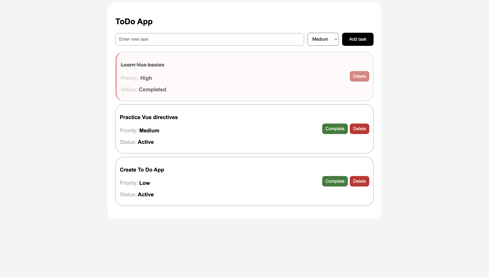

# ToDo App

This is a simple ToDo application built with Vue that allows users to add and remove tasks, categorize them by priority, and mark them as completed.

## Example Screenshot



## Features

- Add and remove tasks
- Categorize tasks by priority
- Mark tasks as completed
- View task status and history

## Tech Stack

- Vue
- JavaScript
- HTML
- CSS

## Installation

1. Clone the repository and install the dependencies:

```bash
git clone https://github.com/PerosevicAleksandar/vue-todo-app.git
cd vue-todo-app
npm install
```

2. Then start the development server:

```bash
npm run dev
```

## Live Demo

[View Live Demo](https://todo-task-mng.netlify.app/)
